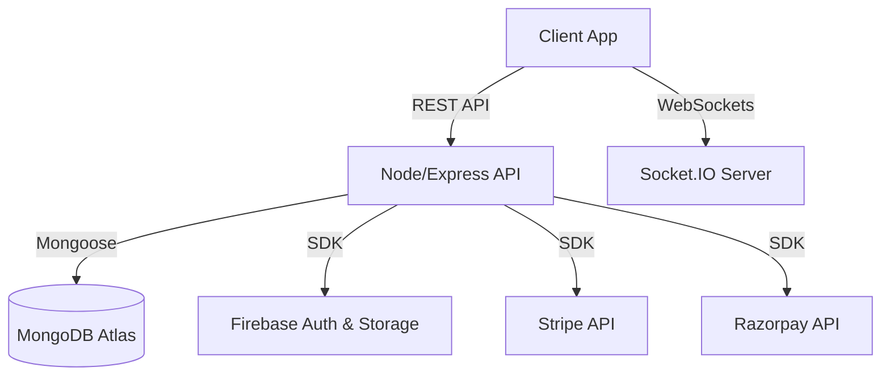

<div align="center">
  

  <br />
  
  <a href="https://git.io/typing-svg">
    
  </a>

  <p align="center">
    <strong>A next-generation, full-stack digital subscription and access tier marketplace.</strong>
  </p>

  <p align="center">
    
    
    
    
    
    
  </p>

  <p align="center">
    <a href="#-about-streamkart">About</a> • 
    <a href="#-key-features">Features</a> • 
    <a href="#-tech-stack">Tech Stack</a> • 
    <a href="#-architecture">Architecture</a> • 
    <a href="#-getting-started">Getting Started</a>
  </p>
</div>

---

## 🌟 About StreamKart

**StreamKart** is a cutting-edge platform designed to revolutionize the way digital subscriptions and access tiers are traded. It provides a seamless, high-performance ecosystem bridging the gap between digital merchants and buyers. Built with a stunning, modern glassmorphic UI, StreamKart offers integrated payment solutions, real-time communications, and instant digital delivery.

---

## ⚡ Key Features

<table>
  <tr>
    <td>🎨 <strong>Premium UI/UX</strong></td>
    <td>State-of-the-art design system featuring responsive glassmorphism, fluid typography, and micro-animations powered by Framer Motion.</td>
  </tr>
  <tr>
    <td>🔐 <strong>Robust Authentication</strong></td>
    <td>Secure, multi-provider login (Google, Phone OTP, Email) powered by Firebase Auth, with strict role-based access control (Admin, Seller, User).</td>
  </tr>
  <tr>
    <td>🛒 <strong>Seller Dashboard</strong></td>
    <td>Comprehensive analytics, real-time sales tracking, financial reporting, and streamlined inventory management.</td>
  </tr>
  <tr>
    <td>💳 <strong>Secure Payments</strong></td>
    <td>Frictionless checkout using integrated payment gateways (Stripe & Razorpay) with automated invoice generation.</td>
  </tr>
  <tr>
    <td>💬 <strong>Live Order Chat</strong></td>
    <td>Real-time Socket.IO communication between buyers and sellers to securely coordinate digital delivery and resolve issues.</td>
  </tr>
  <tr>
    <td>🚀 <strong>Performance Optimized</strong></td>
    <td>Built on Vite with intelligent code-splitting, lazy loading, and optimized global state management using Zustand.</td>
  </tr>
</table>

---

## 🛠 Tech Stack

<details>
<summary><strong>🖥 Frontend Architecture</strong></summary>

- **Framework**: [React 18](https://reactjs.org/) (Vite)
- **Styling**: [Tailwind CSS v3](https://tailwindcss.com/)
- **State Management**: [Zustand](https://github.com/pmndrs/zustand) & [TanStack Query](https://tanstack.com/query)
- **Animations**: [Framer Motion](https://www.framer.com/motion/)
- **Routing**: React Router v6
</details>

<details>
<summary><strong>⚙️ Backend Infrastructure</strong></summary>

- **Server Environment**: Node.js & Express.js
- **Language**: TypeScript
- **Database**: MongoDB Atlas with Mongoose ORM
- **Real-time WebSockets**: Socket.IO
</details>

<details>
<summary><strong>🔌 Third-Party Services</strong></summary>

- **Authentication**: Firebase Auth
- **Payment Processing**: Stripe, Razorpay
- **Cloud Storage**: Firebase Cloud Storage
</details>

---

## 📂 Architecture



---

## 🚀 Getting Started

Follow these instructions to set up StreamKart locally for development and testing.

### Prerequisites

Ensure your local environment meets the following requirements:
- Node.js (v18.0.0 or higher)
- npm or yarn package manager
- A MongoDB Atlas Cluster (or Local MongoDB instance)
- A Firebase Project (with Auth and Storage enabled)
- Stripe / Razorpay Developer Accounts

### 1. Backend Setup

```bash
# Navigate to the backend directory
cd backend

# Install dependencies
npm install

# Create environment configuration
cp .env.example .env

# Start the development server (Defaults to port 5000)
npm run dev
```

### 2. Frontend Setup

```bash
# Navigate to the frontend directory
cd frontend

# Install dependencies
npm install

# Create environment configuration
cp .env.example .env

# Start the Vite development server (Defaults to port 5173)
npm run dev
```

---

## 🔒 Environment Variables

To run this project securely, add the following environment variables to your respective `.env` files. 

> **Warning:** Never commit your `.env` files to version control. Reference the provided `.env.example` files in the repository.

### Backend (`backend/.env`)
| Variable | Description |
|----------|-------------|
| `PORT` | API Server port (e.g., 5000) |
| `MONGO_URI` | MongoDB Connection String |
| `JWT_SECRET` | Secret key for signing JWTs |
| `STRIPE_SECRET_KEY` | Stripe API Secret Key |
| `RAZORPAY_KEY_SECRET`| Razorpay API Secret |

### Frontend (`frontend/.env`)
| Variable | Description |
|----------|-------------|
| `VITE_API_URL` | Backend API URL |
| `VITE_FIREBASE_API_KEY` | Firebase Client API Key |
| `VITE_STRIPE_PUBLIC_KEY`| Stripe Publishable Key |

---

<div align="center">
  
</div>