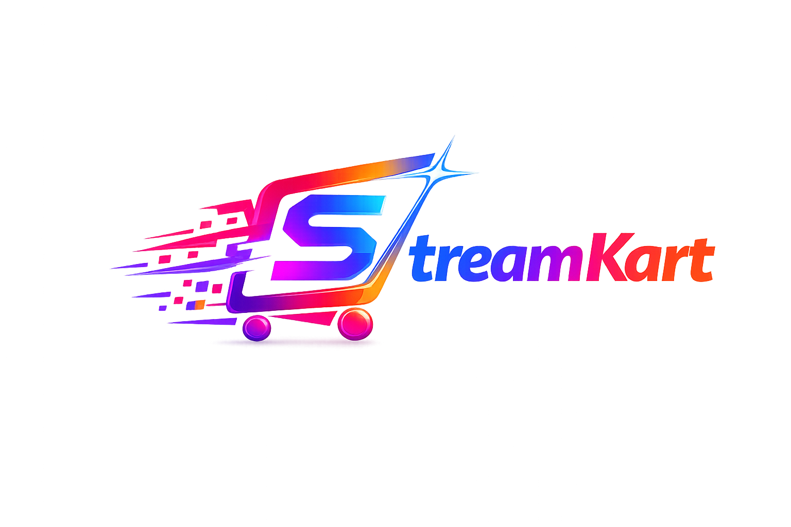

<div align="center">
  
  

  <a href="https://git.io/typing-svg">
    
  </a>

  <p align="center">
    <strong>A next-generation, full-stack digital subscription marketplace.</strong>
  </p>

  <p align="center">
    
    
    
    
    
    
  </p>

  <p align="center">
    <a href="#features">Features</a> • 
    <a href="#tech-stack">Tech Stack</a> • 
    <a href="#getting-started">Getting Started</a> • 
    <a href="#project-structure">Architecture</a>
  </p>

</div>

---

## ⚡ Features

StreamKart provides a seamless, high-performance ecosystem for managing and distributing digital access tiers.

- 🎨 **Premium UI/UX**: Stunning, glassmorphic design system matching top-tier SaaS applications. Smooth animations powered by Framer Motion.
- 🔐 **Robust Authentication**: Multi-provider login (Google, Phone OTP, Email) powered by Firebase Auth.
- 🛒 **Seller Dashboard**: Comprehensive analytics, real-time sales tracking, and inventory management for digital merchants.
- 💳 **Secure Payments**: Frictionless checkout using integrated payment gateways (Stripe & Razorpay).
- 💬 **Live Order Chat**: Real-time communication between buyers and sellers to resolve access issues or coordinate digital delivery.
- 📱 **Fully Responsive**: Flawless experience across desktop, tablet, and mobile browsers.

## 🛠 Tech Stack

### Frontend Ecosystem
- **Framework**: [React.js](https://reactjs.org/) (Vite)
- **Styling**: [Tailwind CSS](https://tailwindcss.com/)
- **State Management**: [Zustand](https://github.com/pmndrs/zustand) & [TanStack Query](https://tanstack.com/query)
- **Animations**: [Framer Motion](https://www.framer.com/motion/)
- **Routing**: React Router v6

### Backend Infrastructure
- **Server**: Node.js & Express
- **Language**: TypeScript
- **Database**: MongoDB Atlas (with Mongoose ORM)
- **Real-time**: Socket.IO (for live chat)

### Third-Party Integrations
- **Auth & Notifications**: Firebase
- **Payments**: Razorpay & Stripe
- **Storage**: Firebase Cloud Storage

## 🚀 Getting Started

Follow these instructions to get a copy of the project up and running on your local machine for development and testing purposes.

### Prerequisites

Ensure you have the following installed on your local environment:
- Node.js (v18.0.0 or higher)
- npm or yarn
- A MongoDB Atlas Account / Local MongoDB
- Firebase Project setup

### 1. Backend Setup

```bash
# Navigate to the backend directory
cd backend

# Install dependencies
npm install

# Create environment configuration
cp .env.example .env

# Start the development server (runs on port 5000)
npm run dev
```

### 2. Frontend Setup

```bash
# Navigate to the frontend directory
cd frontend

# Install dependencies
npm install

# Create environment configuration
cp .env.example .env

# Start the development server (runs on port 5173)
npm run dev
```

Once running, the client will be available at `http://localhost:5173` and the API at `http://localhost:5000`.

## 📂 Project Structure

```text
Streamkart/
├── backend/                  # API Server (Node/Express/TS)
│   ├── src/
│   │   ├── controllers/      # Route handlers
│   │   ├── models/           # Mongoose schemas
│   │   ├── routes/           # API endpoints
│   │   ├── services/         # Business logic
│   │   └── index.ts          # Server entry point
│   └── package.json
└── frontend/                 # Client App (React/Vite)
    ├── src/
    │   ├── components/       # Reusable UI elements
    │   ├── pages/            # View components (Auth, Dashboard, etc.)
    │   ├── services/         # API integration methods
    │   ├── store/            # Zustand global state
    │   └── App.jsx           # Client entry point
    └── package.json
```

## 🔒 Environment Variables

To run this project, you will need to add the following environment variables to your `.env` files. Reference the provided `.env.example` in both `frontend` and `backend` directories for required API keys.

---
<div align="center">
  
</div>